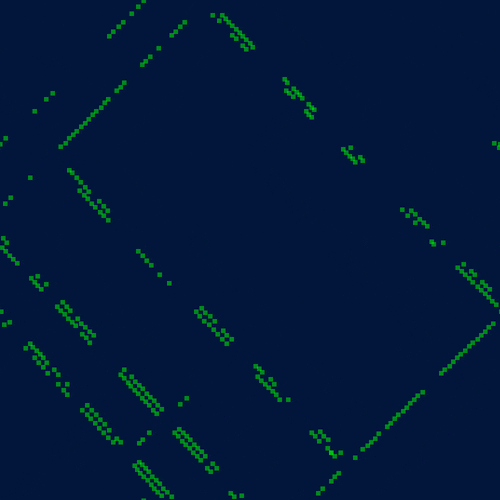
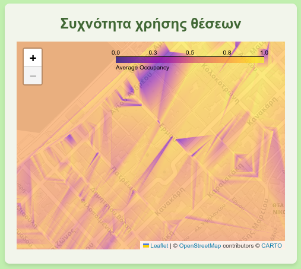

# Smart City Parking

The Smart City Parking project is a comprehensive solution designed to enhance urban parking management through the integration of IoT devices on parking lots to monitor parking availability and provide real-time data to users. The project includes a web application for users to find available parking spots, a backend server for data processing, and a database for storing parking information.

*Figure 1: Final architecture of the Smart City Parking project.*

## Sensor Simulation

The project simulates 794 sensors in different parking spots around the city of Patras. Depending on the time of day and the day of the week, we assume different occupancy rates and update the parking availability of each sensor accordingly. We also simulate the temperature that would be reported by the sensor in the parking lot. The temperature is simulated based on the time of day and the shadow of the parking lot via the ShadeMap API.

*Figure 2: Visualization of simulated shadow data using the ShadeMap API. Sensors that have shaded are drawn in green and sensors without red.*

## IoT Agents

The data of the sensors are sent to a context broker and to the backend server via MQTT. Additionally, the IoT agents send the data to an Influx DB instance for visualization via Grafana.

## Web Application

We also provide a web application that allows users to see and search for an available parking spot in the area. Using the Google Maps API, we can guide the user to the desired parking spot. The web app also has a dashboard panel for an admin to monitor the sensors and see aggregated data about the parking spots, such as average occupancy and average temperature.

*Figure 3: Screenshots of the web application. The first image shows the front page, the second image shows the selection of a parking spot, the third image shows the search for a parking spot, the fourth image shows the navigation to a parking spot, and the last image shows the admin dashboard.*

## Backend Server

The backend server, made with node.js, is responsible for processing the data from the sensors and providing it to the web application. It also handles user authentication and authorization, as well as the communication with the database.

It processes and visualizes aggregate data from the sensors and handles alerts for illegal parking.

